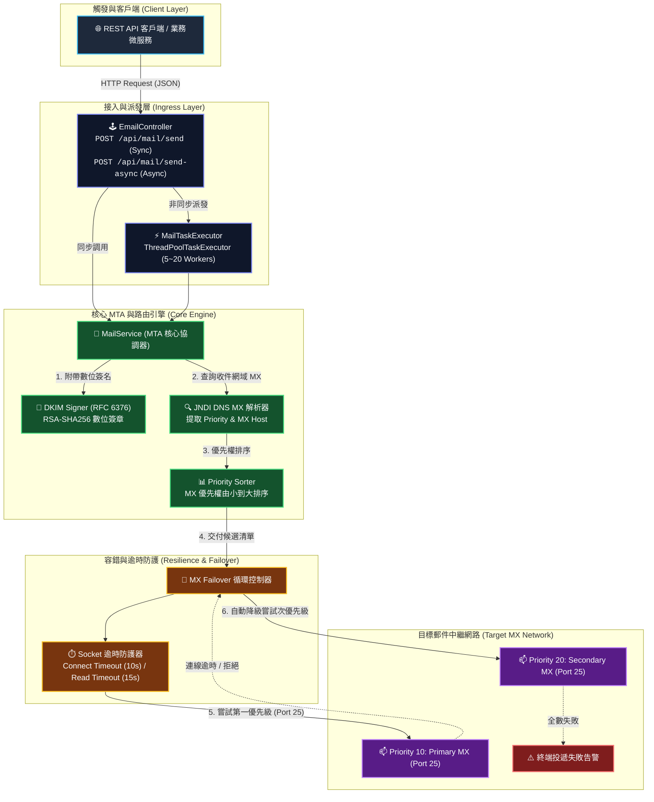

# MailServer Platform (MSP)

[](https://openjdk.org/)
[](https://spring.io/projects/spring-boot)
[](https://tools.ietf.org/html/rfc5321)
[](https://tools.ietf.org/html/rfc6376)

**MailServer Platform (MSP)** 是一個基於 **Java 17** 與 **Spring Boot 3** 建構的高可用自主郵件傳輸代理伺服器 (Mail Transfer Agent, MTA)。

不同於傳統僅作為客戶端透過第三方 Relay（如 Gmail、SendGrid）代發的郵件系統，**MSP** 實現了完整的 **底層 Raw Socket 協議通訊**、**JNDI DNS MX 記錄動態解析**、**STARTTLS 安全通道協商** 與 **DKIM 數位簽章 (RFC 6376)**。系統具備嚴格的連線逾時保護、多 MX 節點自動容錯轉移 (Failover) 與高吞吐非同步執行緒池，可直接將郵件投遞至目標網域的 Port 25 郵件伺服器。

---

## 系統架構



---

## 核心技術特色

### 1. 真正的外網 Port 25 直發 (Direct-to-MX Delivery)
系統不依賴外部 SMTP Relay。給定任意收件信箱（如 `user@gmail.com`），系統將自動使用 JNDI DNS 向根伺服器查詢該網域的 MX 記錄，並直接與對方的外網 MTA 建立 TCP 25 埠通訊。

### 2. 高可用 MX 優先級排序與自動容錯 (Failover)
大型郵件服務商（Google、Microsoft、Yahoo）均配置多個 MX 備援節點。系統支援解析 RFC 規定的 Preference 權重，排序後依序嘗試。若首選 MX 遭遇連線逾時、網路擁塞或伺服器維護，系統將**無縫自動切換至備援 MX 主機**，確保郵件投遞成功率。

### 3. 全鏈路 Socket 逾時保護（防止連線掛起）
在底層 Raw Socket 實作中強制注入：
- **Connection Timeout (預設 10 秒)**：防止目標主機防火牆靜默丟包 (DROP) 導致連線無休止等待。
- **Read SoTimeout (預設 15 秒)**：防止伺服端在交談階段無回應導致執行緒池被消耗殆盡。

### 4. 完整的 SMTP RFC 5321 協議狀態機與 STARTTLS
完整自研交握通訊狀態機，支援指令協商：
```mermaid
sequenceDiagram
    autonumber
    participant MTA as MSP (MailServer Platform)
    participant Target as 目標 MX 伺服器 (Port 25)

    Note over MTA,Target: TCP Handshake (Timeout: 10s)
    Target-->>MTA: 220 target.com ESMTP Service Ready
    MTA->>Target: EHLO mail.yourdomain.com
    Target-->>MTA: 250-STARTTLS / 250 OK
    
    alt 目標支援 STARTTLS
        MTA->>Target: STARTTLS
        Target-->>MTA: 220 2.0.0 Ready to start TLS
        Note over MTA,Target: TLS Upgrade (SSLSocket Handshake)
        MTA->>Target: EHLO mail.yourdomain.com
        Target-->>MTA: 250 OK
    end

    MTA->>Target: MAIL FROM:<admin@yourdomain.com>
    Target-->>MTA: 250 2.1.0 OK
    MTA->>Target: RCPT TO:<recipient@example.com>
    Target-->>MTA: 250 2.1.5 OK
    MTA->>Target: DATA
    Target-->>MTA: 354 Start mail input; end with <CRLF>.<CRLF>
    MTA->>Target: [MIME Body + DKIM-Signature] \r\n.\r\n
    Target-->>MTA: 250 2.0.0 OK: queued as ...
    MTA->>Target: QUIT
    Target-->>MTA: 221 2.0.0 Bye
```

### 5. DKIM 數位簽章 (RFC 6376) 與平滑容錯
- 支援 RSA-SHA256 私鑰簽章，在郵件標頭嵌入 `DKIM-Signature`，避免被收件方視為偽冒郵件 (Spam)。
- 內建平滑容錯機制：若未配置私鑰檔案，系統會優雅降級為普通發送模式並記錄 Warning 日誌，**絕不中斷伺服器啟動**。

---

## 專案結構

```bash
MailServer-Platform/
├── pom.xml                               # Maven 依賴管理 (Spring Boot 3.4, SimpleJavaMail DKIM)
├── src/
│   ├── main/
│   │   ├── resources/
│   │   │   └── application.properties    # MSP 核心參數、超時閥值與 DKIM 設定
│   │   └── java/
│   │       └── com/
│   │           └── msp/
│   │               └── mailserver/
│   │                   ├── MailServerApplication.java    # Spring Boot 主入口
│   │                   ├── Config/
│   │                   │   ├── MailProperties.java       # 配置屬性類別 (@ConfigurationProperties)
│   │                   │   └── AsyncConfig.java          # 郵件非同步執行緒池 (ThreadPoolTaskExecutor)
│   │                   ├── Controller/
│   │                   │   └── EmailController.java      # REST API 端點 (Sync/Async/MX Lookup)
│   │                   ├── Model/
│   │                   │   ├── MxRecord.java             # MX 記錄模型 (支援優先權排序)
│   │                   │   └── SendEmailRequest.java     # 發信請求 DTO
│   │                   └── Service/
│   │                       └── MailService.java          # 核心 MTA 引擎 (JNDI, Socket, STARTTLS, DKIM)
│   └── test/
│       └── java/
│           └── com/
│               └── msp/
│                   └── mailserver/
│                       └── MailServerApplicationTests.java
```

---

## 設定檔說明 (`application.properties`)

```properties
spring.application.name=msp
server.port=8088

# MTA 伺服器網域與預設發信人
mail.server.domain=mail.yourdomain.com
mail.server.default-from=admin@yourdomain.com
mail.server.port=25

# Socket 防卡死超時控制 (毫秒)
mail.server.connect-timeout-ms=10000
mail.server.read-timeout-ms=15000

# DKIM 簽名開關 (若有 pem 金鑰請設為 true)
mail.server.dkim.enabled=false
mail.server.dkim.selector=mail
mail.server.dkim.private-key-path=dkim_private_pkcs8.pem
```

---

## REST API 規格

### 1. 高可用非同步發送郵件（推薦）
- **URL**：`POST /api/mail/send-async`
- **Content-Type**：`application/json`

#### 請求範例：
```json
{
  "to": "target_user@gmail.com",
  "from": "admin@yourdomain.com",
  "subject": "系統通知測試",
  "content": "您好，這是一封來自 MailServer Platform (MSP) 自建 MTA 直發的郵件。"
}
```

#### 回應範例 (`202 Accepted`)：
```json
{
  "success": true,
  "status": "QUEUED",
  "message": "Email task submitted to background executor."
}
```

---

### 2. 同步發送郵件
- **URL**：`POST /api/mail/send`
- **Content-Type**：`application/json`

#### 回應範例 (`200 OK`)：
```json
{
  "success": true,
  "message": "Email delivered successfully via gmail-smtp-in.l.google.com"
}
```

---

### 3. DNS MX 路由診斷端點
- **URL**：`GET /api/mail/mx-lookup?domain=gmail.com`

#### 回應範例：
```json
{
  "domain": "gmail.com",
  "count": 5,
  "mxRecords": [
    "gmail-smtp-in.l.google.com (Priority: 5)",
    "alt1.gmail-smtp-in.l.google.com (Priority: 10)",
    "alt2.gmail-smtp-in.l.google.com (Priority: 20)",
    "alt3.gmail-smtp-in.l.google.com (Priority: 30)",
    "alt4.gmail-smtp-in.l.google.com (Priority: 40)"
  ]
}
```

---

## 外網直發 25 埠必備須知 (MTA Best Practices)

若要確保自建 MTA 寄出的信件不被 Gmail、Outlook 等大型郵件商退信或列入垃圾信箱，請確保具備以下三項 DNS 基礎設施：

1. **解封 Outbound Port 25**：
   - 許多雲端供應商（AWS EC2、GCP、Azure）或一般家用固網 ISP 預設封鎖對外 25 埠，需向供應商申請填表解除封鎖（Port 25 Unblock Request）。
2. **反向 DNS 解析 (rDNS / PTR Record)**：
   - 您的伺服器 Public IP 必須對應到 `mail.yourdomain.com`。
3. **SPF、DKIM 與 DMARC 宣告**：
   - **SPF**：在 DNS 新增 TXT 記錄：`v=spf1 ip4:<您的IP> ~all`。
   - **DKIM**：將公鑰發布在 `mail._domainkey.mail.yourdomain.com` TXT 記錄。
   - **DMARC**：在 `_dmarc.mail.yourdomain.com` 新增 TXT 記錄：`v=DMARC1; p=none; sp=none;`。
